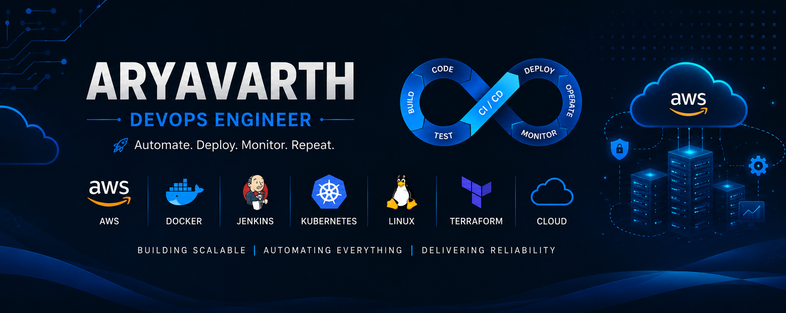

  

 

<h1 align="center">Hi 👋, I'm Aryavarth</h1>

<h3 align="center">
DevOps Engineer | AWS Cloud | Docker | Linux | CI/CD | Monitoring
</h3>

Building scalable cloud infrastructure, automating deployments, and solving production issues.

  

---

# 🚀 About Me

- 💼 DevOps Engineer with **1 year of hands-on experience**
- ☁️ Experienced with **AWS Cloud Infrastructure**
- 🐳 Working with **Docker & Docker Compose**
- ⚙️ Building **CI/CD pipelines using Jenkins**
- 🌐 Configuring **Nginx Reverse Proxy & SSL**
- 📊 Monitoring infrastructure with **Prometheus, Grafana & CloudWatch**
- 🐧 Linux System Administration & Troubleshooting
- 🚀 Passionate about Cloud, DevOps and Automation
- 🌱 Currently expanding my knowledge in **Kubernetes, Terraform and GitOps**

---

# 🛠️ Tech Stack

---

# 💼 Professional Experience

Over the past year I have worked on real-world DevOps tasks including:

- ☁️ AWS Infrastructure (EC2, ECS, ECR, IAM, VPC, ALB, CloudWatch)
- 🐳 Docker & Docker Compose
- ⚙️ Jenkins CI/CD Pipeline Automation
- 🌐 Nginx Reverse Proxy Configuration
- 📊 Prometheus, Grafana, Loki & CloudWatch Monitoring
- 🐧 Linux Server Administration
- 🔒 SSL, DNS & Production Deployments
- 🚀 Application Deployment & Troubleshooting

---

# 📈 GitHub Stats

---

# 📚 Currently Learning

- Kubernetes
- Terraform
- GitOps
- ArgoCD

---

# 📫 Connect With Me

---

# 💡 DevOps Philosophy

> **"Automate repetitive tasks, monitor everything, and keep learning every day."**

---

<h3 align="center">⭐ Thanks for visiting my profile! ⭐</h3>
